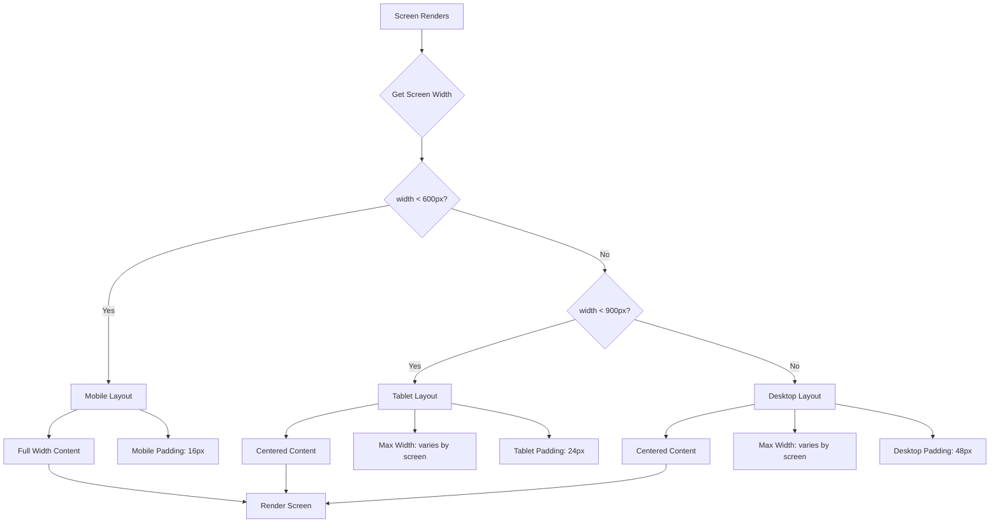

# Design Document: Responsive Screen Overhaul

## Overview

This design document outlines the approach for ensuring all screens and widgets in the Vector messaging application are fully responsive and flexible across mobile, tablet, and desktop screen sizes. The implementation will leverage the existing design system's responsive utilities (`ResponsiveContainer`, `ResponsiveBuilder`, `ResponsiveLayout`) while extending coverage to all screens that currently lack proper responsive handling.

The goal is to provide a consistent, polished user experience regardless of device size or orientation, with content appropriately constrained and centered on larger screens while maintaining full functionality on mobile devices.

## Architecture

### Responsive Strategy

The application will use a three-tier responsive approach:

1. **Mobile-First Base**: All screens start with mobile-optimized layouts
2. **Breakpoint Adaptation**: Layouts adapt at defined breakpoints (600px, 900px)
3. **Content Constraints**: Maximum content widths prevent overly wide layouts on large screens

### Breakpoint Definitions (Existing)

```
Mobile:  width < 600px
Tablet:  600px <= width < 900px
Desktop: width >= 900px
```

### Content Width Constraints

| Screen Type | Mobile | Tablet | Desktop |
|-------------|--------|--------|---------|
| Chat Lists | 100% | 700px | 800px |
| Chat Screen | 100% | 700px | 800px |
| Auth Forms | 100% | 400px | 400px |
| Profile/Settings | 100% | 600px | 600px |
| User Lists | 100% | 600px | 600px |
| Dialogs | 100% | 400px | 400px |
| Media Gallery | 100% | 100% | 1200px |

## Components and Interfaces

### Existing Responsive Components (No Changes Needed)

```dart
// ResponsiveContainer - wraps content with max-width and centering
ResponsiveContainer({
  required Widget child,
  bool centerContent = true,
  double? maxWidth,
  EdgeInsets? padding,
  bool scrollable = false,
})

// ResponsiveBuilder - builds different layouts per device size
ResponsiveBuilder({
  required Widget Function(BuildContext) mobile,
  Widget Function(BuildContext)? tablet,
  Widget Function(BuildContext)? desktop,
})

// ResponsiveLayout - utility class for responsive calculations
ResponsiveLayout.getDeviceSize(context)
ResponsiveLayout.getMaxContentWidth(context)
ResponsiveLayout.getHorizontalPadding(context)
ResponsiveLayout.value<T>(context: context, mobile: T, tablet: T?, desktop: T?)
```

### New Helper: ResponsiveScaffold

A convenience wrapper that applies responsive constraints to scaffold body content:

```dart
class ResponsiveScaffold extends StatelessWidget {
  final PreferredSizeWidget? appBar;
  final Widget body;
  final Widget? floatingActionButton;
  final Widget? bottomNavigationBar;
  final double? maxContentWidth;
  final bool centerOnDesktop;
  
  // Automatically wraps body with ResponsiveContainer
}
```

### Screen-Specific Max Widths

```dart
abstract class ResponsiveMaxWidths {
  static const double chatList = 800.0;
  static const double chatScreen = 800.0;
  static const double authForm = 400.0;
  static const double profileSettings = 600.0;
  static const double userList = 600.0;
  static const double dialog = 400.0;
  static const double createGroup = 500.0;
  static const double mediaGallery = 1200.0;
  static const double textViewer = 800.0;
}
```

## Data Models

No new data models are required. The responsive system uses existing Flutter layout primitives and the design system's spacing tokens.

## Correctness Properties

*A property is a characteristic or behavior that should hold true across all valid executions of a system-essentially, a formal statement about what the system should do. Properties serve as the bridge between human-readable specifications and machine-verifiable correctness guarantees.*

Based on the prework analysis, the following correctness properties have been identified:

### Property 1: Desktop content centering and max-width constraint
*For any* screen width greater than 900px, the main content area SHALL be centered horizontally and constrained to a maximum width appropriate for that screen type (400-800px depending on screen category).
**Validates: Requirements 1.3, 3.1, 3.2, 3.3, 4.1, 4.2, 5.1, 5.2, 5.3, 5.4, 5.6, 6.3, 7.5**

### Property 2: Tablet padding adaptation
*For any* screen width between 600px and 900px, horizontal padding SHALL be greater than mobile padding (tablet padding >= 24px vs mobile padding of 16px).
**Validates: Requirements 1.4, 5.5**

### Property 3: Responsive breakpoint recalculation on orientation change
*For any* orientation change event, the responsive breakpoint calculation SHALL produce the correct DeviceSize based on the new screen width.
**Validates: Requirements 1.5, 9.5**

### Property 4: Media gallery grid column adaptation
*For any* screen width, the media gallery grid SHALL display 2 columns on mobile (< 600px), 3 columns on tablet (600-900px), and 4+ columns on desktop (>= 900px).
**Validates: Requirements 6.1**

### Property 5: Dialog max-width constraint on large screens
*For any* dialog displayed on tablet or desktop (width >= 600px), the dialog width SHALL be constrained to a maximum of 400px.
**Validates: Requirements 7.1**

### Property 6: Widget flexibility - no text overflow
*For any* width from 280px to 1920px, the ModernChatListItem widget SHALL render without text overflow (no clipping or ellipsis failure).
**Validates: Requirements 8.1**

### Property 7: Search bar expansion with constraints
*For any* parent container width, the SearchBarWidget SHALL expand to fill available width while not exceeding the parent's max-width constraint.
**Validates: Requirements 8.4**

### Property 8: Bottom navigation spacing adaptation
*For any* screen width, the ModernBottomNavigation item spacing SHALL increase proportionally on wider screens while maintaining minimum touch targets of 44px.
**Validates: Requirements 8.5, 3.5**

### Property 9: Orientation state preservation
*For any* orientation change, user input state (text field values, scroll positions) SHALL be preserved after the layout rebuilds.
**Validates: Requirements 9.2**

### Property 10: Message bubble width adaptation
*For any* parent container width, message bubbles SHALL constrain their width to at most 75% of the container width on mobile and 60% on tablet/desktop.
**Validates: Requirements 2.3, 8.2**

## Error Handling

### Layout Overflow Prevention

- All text widgets in constrained containers use `overflow: TextOverflow.ellipsis` or are wrapped in `Flexible`/`Expanded`
- Row widgets with multiple children use `Flexible` to prevent horizontal overflow
- Images use `BoxFit.contain` or `BoxFit.cover` with explicit constraints

### Graceful Degradation

- If responsive calculations fail, fall back to mobile layout (safest default)
- Use `LayoutBuilder` with null-safe width access
- Handle edge cases like very narrow widths (< 280px) by allowing horizontal scroll

### Orientation Change Handling

- Use `AutomaticKeepAliveClientMixin` for stateful screens to preserve state
- Store scroll positions in state and restore after orientation change
- Use `RestorationMixin` for critical user input preservation

## Testing Strategy

### Dual Testing Approach

The implementation will use both unit tests and property-based tests:

1. **Unit Tests**: Verify specific examples at exact breakpoints (599px, 600px, 601px, 899px, 900px, 901px)
2. **Property-Based Tests**: Verify properties hold across random widths within valid ranges

### Property-Based Testing Framework

The project will use the `glados` package for Dart property-based testing:

```yaml
dev_dependencies:
  glados: ^1.1.1
```

### Test Categories

1. **Responsive Calculation Tests**
   - Verify `ResponsiveLayout.getDeviceSize()` returns correct values
   - Verify `ResponsiveLayout.getMaxContentWidth()` returns correct constraints
   - Verify padding calculations at various widths

2. **Widget Constraint Tests**
   - Verify widgets respect max-width constraints
   - Verify widgets don't overflow at any valid width
   - Verify flexible widgets expand correctly

3. **Layout Adaptation Tests**
   - Verify grid column counts at different widths
   - Verify dialog sizing on different screen sizes
   - Verify content centering on desktop

4. **State Preservation Tests**
   - Verify scroll position preservation across rebuilds
   - Verify text input preservation across orientation changes

### Test Annotation Format

Each property-based test will be annotated with:
```dart
// **Feature: responsive-screen-overhaul, Property 1: Desktop content centering and max-width constraint**
// **Validates: Requirements 1.3, 3.1, 3.2, 3.3**
```

### Minimum Test Iterations

Property-based tests will run a minimum of 100 iterations to ensure adequate coverage of the input space.

## Implementation Approach

### Phase 1: Core Infrastructure
1. Add `ResponsiveMaxWidths` constants to design system
2. Create `ResponsiveScaffold` helper widget
3. Update `ResponsiveLayout` with any missing utility methods

### Phase 2: Screen Updates
1. Update ChatScreen with ResponsiveContainer
2. Update authentication screens (already partially done)
3. Update Profile and Settings screens
4. Update list screens (PrivateChatList, GroupChatList, etc.)
5. Update media screens
6. Update dialog/modal presentations

### Phase 3: Widget Updates
1. Audit and fix ModernChatListItem for flexibility
2. Audit and fix ModernMessageBubble constraints
3. Update SearchBarWidget expansion behavior
4. Update ModernBottomNavigation spacing

### Phase 4: Testing
1. Write property-based tests for each correctness property
2. Write unit tests for edge cases
3. Manual testing across device sizes

## Mermaid Diagram: Responsive Layout Flow



## Screen-by-Screen Changes

### ChatScreen
- Wrap message list in ResponsiveContainer with maxWidth: 800px
- Center input area on desktop
- Increase message bubble padding on tablet/desktop

### LoginScreen / RegisterScreen / ForgotPasswordScreen
- Already has responsive logic, verify max-width is 400px on tablet/desktop
- Ensure consistent pattern across all auth screens

### ProfileScreen / SettingsScreen
- Wrap content in ResponsiveContainer with maxWidth: 600px
- Use card-based layout on tablet/desktop

### PrivateChatList / GroupChatList
- Already has responsive logic (maxWidth: 700px)
- Update to use ResponsiveContainer for consistency
- Increase to 800px to match design spec

### CreatePrivateChatScreen / AddParticipantsScreen
- Wrap user list in ResponsiveContainer with maxWidth: 600px

### MediaGalleryScreen
- Use ResponsiveLayout.value() for grid column count
- Constrain overall width to 1200px on very large screens

### Dialogs and Bottom Sheets
- Create responsive dialog helper that constrains width on large screens
- Convert bottom sheets to centered dialogs on desktop
